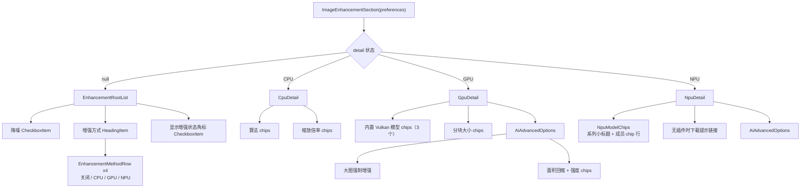

## 需求概述

重新设计「图像增强」设置区。该区域目前被两个入口共用：阅读器内底部弹窗的独立标签页（`ImageEnhancementPage`）与设置 → 阅读器（`PreferenceItem.CustomPreference`）。

## 现状问题

一屏内平铺了「降噪开关 + 增强总开关 + CPU/GPU/NPU 三组选择器 + 3 组条件出现的参数 chips + 2 个插在中间的开关 + AI 专属开关」，层级过密，主次不分，且参数行随档位出现/消失。

**用户实测截图暴露的 NPU 分组具体缺陷**（本次重设计的主要触发点）：

1. **组头与成员视觉同级** —— 组头 `W2xEX · Omni Small` 与成员 `Omni Small` 都是同款圆角 chip，展开后看不出从属关系。
2. **换行后成员与无关项混排** —— 展开的 4 个成员紧跟 `NomosUni Span` / `realesr` 之后，视觉上像 6 个并列选项。
3. **组头文字过长** —— `W2xEX · Omni Small` 撑出超宽 chip，破坏栅格节奏。
4. **展开时高度暴涨**，把下方设置全部推走。

根因：**组头被做成了 chip**。chip 本身作为「平级选项」是合适的（CPU 的两个算法、GPU 的三个模型都该用 chip），问题在于同一个 chip 组件既当容器又当选项。

## 目标形态

### 一级（根页面）

只负责「选方式」，一屏可见：

- 降噪（独立开关，与档位无关，始终可点）
- 增强方式：四行单选 —— 关闭 / CPU / GPU / NPU
- 每行行尾显示当前取值（CPU 行显示当前算法名；GPU / NPU 行显示当前模型名，非当前方式显示占位符）
- 显示增强状态角标（独立开关）

关闭方式不再是「把所有内容藏起来」，而是列表里的一个可选项，任何时候都能切换。

### 二级详情页（就地切换，不跳转页面）

**三个详情页统一为「小标题 + chip 行」结构**（用户已确认）：

- **CPU 详情**：小标题「增强算法」+ 算法 chips；小标题「缩放倍率」+ 倍率 chips。
- **GPU 详情**：小标题「模型」+ 内置 Vulkan 模型 chips（3 个）；小标题「分块大小」+ 档位 chips。
- **NPU 详情**：小标题「模型」→ **系列小标题 + 成员 chips**（不折叠，见「核心决策二」）；无插件时显示下载提示。
- **AI 高级项**（大图强制增强、面积回缩、回缩强度）出现在 GPU 与 NPU 两个详情页底部，两处显示同一状态。

### 交互约定

- 点击 CPU / GPU / NPU 行 = 立刻启用该方式并进入其详情页（避免「点开又返回，什么都没发生」）；点击关闭行 = 直接关闭。
- 详情页顶部有「返回」行，系统返回键也能退回一级。
- 两个入口行为完全一致。

### 边界与约束

- 不新增、不重命名、不删除任何偏好键；渲染与缓存指纹逻辑不变。
- NPU 相关门控与容错全部保留：无 CDSP/无 QNN 运行时不出现 NPU 行；无可用插件时显示下载提示。
- 视觉沿用现有 Material 3 设置页规范，不引入新的视觉语言。

## 技术栈

沿用项目现有技术栈，**不引入任何新依赖**：

- Kotlin + Jetpack Compose + Material 3（`androidx.compose.material3`）
- 图标：`androidx.compose.material:material-icons-extended`（已在 `gradle/libs.versions.toml:92`）
- 文案：moko-resources（`tachiyomi.i18n.MR`），需同步 `base` / `zh-rCN` / `zh-rTW` 三份
- 复用组件：`presentation-core` 的 `HeadingItem` / `CheckboxItem` / `SettingsChipRow` / `SettingsItemsPaddings`

## 实现方案

### 核心决策一：就地父子屏切换，禁止导航

两个调用点都**不在 voyager 导航环境内**：设置页的 `CustomPreference` 位于 Preferences 渲染流程中，阅读器标签页是 `ColumnScope` 内容。

因此**绝不使用** `navigator.push/pop` 或 `LocalNavigator.currentOrThrow`（本项目历史上已因此崩溃：`IllegalStateException: CompositionLocal is null`）。

采用仓库内**已验证可用**的同款模式 —— `SettingsKomihoBackupScreen.kt:184-192` 的「父屏持有子屏状态、就地切换」：

- 用普通 `remember`（非 `rememberSaveable`）持有当前详情页标识，与备份页 `showSyncConn` 一致；二级页是瞬时 UI 状态，不应跨进程恢复。
- `BackHandler(enabled = detail != null) { detail = null }`，与备份页写法一致。
- 子屏顶部插入「返回」行（复用已有 `MR.strings.action_back`，与同步连接子屏的 `komiho_sync_back` 实现思路一致）。

好处：**两个调用点一行都不用改**，天然保证两处结构一致（这正是当初抽出 `ImageEnhancementSection` 的目的，避免两套布局各自漂移）。

### 核心决策二：NPU 用「系列小标题 + 成员 chip」，组头不再是 chip

用户已确认统一为 chip 风。关键动作只有两个：

1. **组头从 chip 变成独立小标题** —— 用现有 `EnhancementParamLabel`（`HeadingItem` 同款样式），与 CPU 详情的「缩放倍率」、GPU 详情的「分块大小」完全一致。
2. **取消折叠** —— 成员直接平铺，不再有手风琴/展开箭头。

呈现形态（按实际入库的 8 个模型）：

```
模型
W2xEX                                    ← 小标题（不再是 chip）
[Omni Small] [Omni Turbo] [Photo Small] [Universal Fast]
Real-CUGAN
[Pro Denoise3x] [SE Denoise3x]
[NomosUni Span] [realesr]                ← 单成员/无系列：直接平铺，不给小标题
```

**分组规则**（沿用现有 `seriesName()` 语义，成员数阈值从"是否折叠"改为"是否显示小标题"）：

- 系列成员数 **> 1** → 输出该系列的小标题，成员 chip 显示**去掉系列前缀的短名**（`shortLabel(series)`）。
- 系列成员数 **== 1**，或无法解析出系列名 → 不设小标题，直接 chip，显示**完整 label**（`displayLabel()`）。
- 每组独立一个 `SettingsChipRow`（FlowRow），组间天然分行，成员不会再与其它系列的项混排。

**对照截图 4 个问题的解决情况**：

| 截图问题 | 改良后 |
| --- | --- |
| 组头与成员视觉同级 | ✅ 组头变成小标题 |
| 成员与 `realesr` 混排成并列 | ✅ 小标题 + 独立 FlowRow 分隔各组 |
| 组头 `W2xEX · Omni Small` 超宽 | ✅ 组头不再占 chip 宽度 |
| 展开时高度暴涨 | ✅ 取消折叠，高度固定约 4 行 |


**已知残留特性（可接受）**：chip 宽窄天生不一（`Universal Fast` 比 `Omni Turbo` 宽），FlowRow 换行后左右边缘不对齐。这与现有 CPU/GPU 的 chip 行表现一致，属于"一致的不整齐"，不新增问题。

### 关键取舍

**取舍一：为什么「点击方式行」同时承担启用与进入详情**

若拆成「点 radio 启用 + 点行尾箭头进详情」，单行需要两个点击热区，在手机上误触率高。合并为一个动作后，点击即启用并进入详情 —— 用户看到的当前模型立刻生效，返回后一级列表的副标题也同步更新。

对 GPU / NPU 行，启用时需要选一个具体模型：

- GPU：当前 `aiModelId` 已是 Vulkan 模型则保持不变，否则回落到 `AiUpscaleModel.Default`（`OmniMiniV2`）。
- NPU：当前已是 NPU 模型则保持不变，否则取该机代次兼容列表的第一项；若列表为空（没装模型包）则只进入详情页展示下载提示，不改变当前设置。

这样既不会静默切换用户已选的模型，也不会出现「进详情前界面毫无反馈」。

**取舍二：AI 高级项放在 GPU / NPU 两个详情页**

这两个开关只对 AI 档（`mode == 5`）生效，而 GPU 与 NPU 详情都只可能在 AI 档下进入，因此放在两处都语义自洽。抽成一个共享 composable，两处引用同一份偏好，状态天然一致。

**取舍三：状态角标开关改为一级常驻**

现状它被包在 `if (mode != 0)` 内，关闭增强时会一起消失。新结构下它与降噪同为一类「独立开关」，放在一级常驻，不再随档位隐藏。

**取舍四：NPU 不折叠**

原来用「手风琴」是为了在横向 chip 数组里压高度，但它需要用户多点一次才能看到有什么，且展开时高度暴涨（截图问题 4）。改为平铺后，8 个模型约 4 行，永远可见、高度稳定。相应地，`expandedSeries` 状态、`LaunchedEffect(selectedSeries)` 自动展开、`KeyboardArrowUp/Down` 展开箭头全部删除。

### 组件树



### 数据流

所有读写仍是 `ReaderPreferences` 上原有的 `Preference<*>`，无新增状态源：

```
点击方式行 → setMode(preferences.enhancementLastMode / enhancementMode)
           → 必要时代写 aiModelId
           → detail = 目标详情页
详情页 chips → 直接写对应 Preference（mode / lanczosScale / aiTileSize / aiModelId / ...）
系统返回键或返回行 → detail = null
```

`mode` 来源保持 `preferences.enhancementMode.collectAsState()`；`setMode` 闭包保持「同时写 `enhancementLastMode` 与 `enhancementMode`」的既有语义。

## 目录结构

```
app/src/main/java/eu/kanade/presentation/reader/settings/
├── ImageEnhancementSection.kt        # [MODIFY] 入口 + 路由 + 一级列表 + CPU/GPU/NPU 详情正文
│                                     #   保留 private：displayLabel / seriesName / shortLabel
│                                     #                / EnhancementGroupLabel / EnhancementParamLabel
│                                     #   删除：NpuModelPicker（含 expandedSeries / 展开箭头）
│                                     #   新增 private：NpuModelChips（系列小标题 + chip 行）
└── EnhancementSettingsItems.kt       # [NEW] 同包通用组件（internal）：
                                      #       EnhancementMethodRow、AiAdvancedOptions

i18n/src/commonMain/moko-resources/
├── base/strings.xml                  # [MODIFY] 追加新键
├── zh-rCN/strings.xml                # [MODIFY] 追加新键
└── zh-rTW/strings.xml                # [MODIFY] 追加新键

# 调用点（明确不改动，仅用于验证）
app/src/main/java/eu/kanade/presentation/reader/settings/ImageEnhancementPage.kt      # [UNCHANGED]
app/src/main/java/eu/kanade/presentation/more/settings/screen/SettingsReaderScreen.kt # [UNCHANGED]
```

### 文件职责

**`ImageEnhancementSection.kt`（修改）**

- **用途**：该设置区唯一入口，同时服务阅读器标签页与设置页两条调用链。
- **功能**：

1. 保持 `fun ImageEnhancementSection(preferences: ReaderPreferences, modifier: Modifier = Modifier)` 签名不变。
2. 新增详情路由：`var detail by remember { mutableStateOf<EnhancementDetail?>(null) }` + `BackHandler`。
3. 一级列表：降噪、增强方式标题、四个方式行、状态角标。
4. 三个详情页正文。
5. `NpuModelChips`：按 `seriesName()` 分组 → 每组一个 `EnhancementParamLabel`（仅多成员组）+ 一个 `SettingsChipRow`。

- **实现要求**：
- 原 `if (mode != 0)` 外层包裹从一级列表中移除（改为「关闭」选项）。
- NPU 行的显示门控保持 `Waifu2x.isCdspAvailable && Waifu2x.isQnnRuntimeAvailable`。
- NPU 详情内部的 `DisposableEffect`（ON_RESUME 重扫）+ `LaunchedEffect` 原样迁移，不可丢失。
- **删除** `NpuModelPicker` 及其 `expandedSeries` / `LaunchedEffect(selectedSeries)` / `KeyboardArrowUp|Down` 展开箭头 / 组头 chip 相关代码；`seriesName()` 与 `shortLabel()` 保留复用。
- 所有颜色/字号一律取自 `MaterialTheme.colorScheme` / `MaterialTheme.typography` 与 `SettingsItemsPaddings`，保证每一套主题与动态取色都正确。

**`EnhancementSettingsItems.kt`（新建）**

- **用途**：放置与偏好无关的通用呈现组件，避免 `ImageEnhancementSection.kt` 继续膨胀。
- **功能**：

1. `EnhancementMethodRow(label, subtitle, selected, onClick)`：一级列表行 —— `RadioButton` + 标题/副标题两行文本 + 行尾右箭头；整行 `clickable`。
2. `AiAdvancedOptions(preferences: ReaderPreferences)`：大图强制增强开关、面积回缩开关、回缩开启时的强度 chips。

> 注意：**不再需要 `EnhancementModelRow`** —— 详情页的模型一律用 `FilterChip`。

- **实现要求**：
- 可见性用 `internal`（同包内使用，不外泄到模块外）。
- `presentation-core` 的 `BaseSettingsItem` 是 `private`，无法复用（`SettingsItems.kt:468`），此处需自建行布局，但内边距、`verticalArrangement` 等必须与 `BaseSettingsItem` 保持一致（水平 `SettingsItemsPaddings.Horizontal`、垂直 `SettingsItemsPaddings.Vertical`），确保与同页其它设置项对齐。
- 右箭头图标建议 `Icons.AutoMirrored.Filled.KeyboardArrowRight`（项目已在用 `Icons.AutoMirrored.Filled.ArrowBack`，自动镜像包可用），`contentDescription = null`。

**i18n（修改三份）**

- 新增键（`base` 英文 / `zh-rCN` / `zh-rTW`）：
- `enhancement_section_methods` —— 一级「增强方式」标题
- `enhancement_detail_model` —— 详情页「模型」小标题
- `enhancement_detail_advanced` —— 详情页「AI 选项」小标题
- 直接复用已有键，不重复新增：`enhancement_off`、`enhancement_group_cpu`、`enhancement_group_gpu`、`enhancement_group_npu`、`action_back`、`enhancement_denoise`、`pref_show_enhancement_status`、`pref_ai_tile_size`、`enhancement_scale`、`ai_bypass_fit`、`ai_area_downscale`、`ai_area_downscale_strength`、`ai_model_plugin_hint`、`pref_enhancement_mode`
- 系列名（`W2xEX` / `Real-CUGAN` / `NomosUni`）来自模型包 manifest 的 `group` 字段或 label 首词，**不需要 i18n**。

## 关键代码结构

```
/** 二级详情页标识。就地切换，不进入导航栈。 */
private enum class EnhancementDetail { CPU, GPU, NPU }

@Composable
fun ImageEnhancementSection(
    preferences: ReaderPreferences,
    modifier: Modifier = Modifier,
) {
    // 与 SettingsKomihoBackupScreen.showSyncConn 同款：普通 remember，
    // 二级页是瞬时 UI 状态，不需要跨进程恢复。
    var detail by remember { mutableStateOf<EnhancementDetail?>(null) }
    BackHandler(enabled = detail != null) { detail = null }

    Column(modifier) {
        when (detail) {
            null -> EnhancementRootList(preferences, onOpen = { detail = it })
            EnhancementDetail.CPU -> CpuDetail(preferences, onBack = { detail = null })
            EnhancementDetail.GPU -> GpuDetail(preferences, onBack = { detail = null })
            EnhancementDetail.NPU -> NpuDetail(preferences, onBack = { detail = null })
        }
    }
}
```

```
/**
 * 一级列表的单行：radio 表示选中，行尾箭头表示可进入详情。
 * 整行点击 = 启用该方式并进入详情（见「取舍一」）。
 */
@Composable
internal fun EnhancementMethodRow(
    label: String,
    subtitle: String?,
    selected: Boolean,
    onClick: () -> Unit,
)
```

```
/** NPU 详情正文：按系列分组，每组「小标题 + chip 行」（不折叠）。 */
@Composable
private fun NpuModelChips(
    models: List<PluginUpscaleModel>,
    activeModel: UpscaleModelSpec,
    onSelect: (PluginUpscaleModel) -> Unit,
) {
    // groupBy 保持遭遇顺序 = manifest 顺序
    val bySeries = models.groupBy { it.seriesName() }
    bySeries.forEach { (series, members) ->
        // 多成员才给系列小标题；单成员/无系列直接平铺，避免标题比内容还多
        if (series != null && members.size > 1) {
            EnhancementParamLabel(series)
        }
        SettingsChipRow {
            members.forEach { model ->
                FilterChip(
                    selected = model == activeModel,
                    onClick = { onSelect(model) },
                    label = {
                        // 有系列标题时显示短名，否则显示完整名
                        Text(
                            if (series != null && members.size > 1) {
                                model.shortLabel(series)
                            } else {
                                model.displayLabel()
                            },
                        )
                    },
                )
            }
        }
    }
}
```

## 实施注意

- **禁止导航**：任何 `navigator` / `LocalNavigator` 用法都会在两个调用点崩溃，只能就地切换状态。
- **偏好零改动**：`enhancementMode` / `enhancementLastMode` / `aiModelId` / `lanczosScale` / `aiTileSize` / `denoiseLevel` / `aiBypassFitGate` / `aiAreaDownscale` / `aiAreaDownscaleStrength` / `showEnhancementStatus` 全部沿用现有键名与取值范围。
- **`enhancementCacheKey()` 不需修改**：本次只改呈现，不改任何影响像素的取值逻辑（`ReaderPreferences.kt:330`）。
- **`setMode` 语义保持**：仍同时写 `enhancementLastMode` 与 `enhancementMode`。
- **NPU 扫描不可退化**：`DisposableEffect` 的 ON_RESUME 重扫与 `LaunchedEffect(Unit)` 首次扫描必须保留，且必须放在 NPU 详情正文内（只有进入该页才需要扫描）；一级列表的副标题只用 `UpscaleModelRegistry.findById` 与缓存的 `npuModels()`，不触发重扫。
- **删除折叠，保留分组解析**：`NpuModelPicker`、`expandedSeries`、`LaunchedEffect(selectedSeries)`、`KeyboardArrowUp/Down` 一并删除；`seriesName()`（`group` 字段优先，label 首词兜底）与 `shortLabel()` 必须保留，它们现在服务于分组小标题与短名。
- **三页风格一致**：CPU / GPU / NPU 详情一律「小标题 + chip 行」，不要给 NPU 单独引入列表行样式。
- **blast radius**：两个调用点、`ReaderPreferences`、`Waifu2x`、`UpscaleModelRegistry`、模型包协议全部不动；改动集中在 1 个文件重写 + 1 个新文件 + 3 份 i18n。
- **无性能开销**：无新的列表/轮询；`npuModels()` 读内存缓存，NPU 扫描频次与现状相同。

## 验证方式

本机**没有 JDK**（`JAVA_HOME` 未设置，`C:\Program Files`、`E:\Code`、`.workbuddy\binaries` 下均无 `java.exe`），无法在本地编译。验证依赖：

1. 静态核对：引用点与私有符号迁移无遗漏（可用 LSP 做引用分析）。
2. 用户在 Android Studio 编译，或推送后由 CI 编译。
3. 真机手测清单：

- 阅读器内标签页与设置 → 阅读器，两个入口行为一致；
- 四个方式行切换正确，行尾副标题跟随更新；
- 关闭行可关闭增强，且不影响降噪开关；
- CPU 详情改算法/倍率即时生效；
- GPU 详情改模型/分块大小即时生效；
- NPU 详情：`W2xEX` / `Real-CUGAN` 各带小标题 + 一行 chips，`NomosUni Span` 与 `realesr` 无小标题直接平铺；切换模型即时生效且 chip 高亮跟随；卸载模型包后返回页面能看到下载提示；
- 三个详情页的小标题 + chip 行视觉风格一致；
- 两个详情页里的 AI 高级项状态互通；
- 系统返回键在详情页退回一级，在一级页正常退出。

## 设计定位

Android 原生设置页重构，**不引入新视觉语言**：目标是把过密的单屏改成「一级单选 + 二级详情」的信息层级，视觉上完全沿用项目现有 Material 3 设置页规范（`presentation-core` 的 `BaseSettingsItem` 内边距、`HeadingItem` 标题、`SettingsChipRow` chip 行），保证与同页其它设置项混排时不突兀。

页面有多套主题（`YotsubaColorScheme` / `YinYangColorScheme` / `TidalWaveColorScheme` 等）且支持动态取色，因此**一切颜色与字号必须取自 `MaterialTheme.colorScheme` / `MaterialTheme.typography`**，不得硬编码色值。

## 一级列表布局（自顶向下）

1. 降噪开关行：`CheckboxItem`，行内左勾选框 + 文本，与现状一致。
2. 分组标题「增强方式」：`HeadingItem` 样式，弱化色（`onSurfaceVariant`）。
3. 四个方式行：`RadioButton` 在左，主标题（关闭 / CPU / GPU / NPU）在上、副标题（当前算法名或模型名）在下，行尾右箭头图标；选中行高亮 radio，整行可点。

- 副标题用 `bodyMedium` + `onSurfaceVariant`，比主标题弱一级，形成「主标题选方式、副标题报当前值」的层次。
- 非当前方式的副标题显示占位符 `—`，避免误读为「已选中」。
- 未选中行的行尾箭头与选中行保持一致（箭头只表达「可进入」，不代表状态）。

4. 显示增强状态角标开关行：`CheckboxItem`，与降噪同款。

一级共 6 行，一屏内无需滚动。

## 二级详情页布局

统一结构：顶部「返回」行（左箭头图标 + `action_back` 文案）→ 分组标题 → 内容。三页一律「小标题 + chip 行」。

- **CPU 详情**：小标题「增强算法」+ 算法 chips；小标题「缩放倍率」+ 倍率 chips。因进入路径已把档位设为 CPU，两个小节恒定可见，不再有条件闪烁。
- **GPU 详情**：小标题「模型」+ 内置 Vulkan 模型 chips（3 个，含当前选中态）；小标题「分块大小」+ 档位 chips；末段「AI 选项」+ 两个开关（面积回缩开启时追加「滤波强度」chips）。
- **NPU 详情**：小标题「模型」→ 系列分组（多成员组带系列小标题 + chip 行；单成员/无系列直接平铺 chips）；无可用插件时替换为一行可点击的下划线提示（跳转模型包发布页）；末段「AI 选项」与 GPU 详情同款。

## 动效与反馈

- chip 与开关沿用 Material 3 内建涟漪与状态动画，不额外加动画。
- 一级 ↔ 二级为瞬时切换（与备份页子屏一致），不加转场动画，避免在可滚动设置列表内引入高度跳变。
- 无加载态：设置项均为本地偏好读写，即时生效。

## 可访问性

- 右箭头图标 `contentDescription = null`（该行已有文本标签，避免读屏重复播报）；返回行左箭头沿用 `action_back` 作为内容描述。
- chip 的选中态由 Material 3 原生语义表达，无需额外处理。
- 整行可点区域高度不小于 `SettingsItemsPaddings.Vertical` 定义的标准设置项高度，保证触摸目标达标。

## Agent Extensions

### Skill

- **lsp-code-analysis**
- Purpose: 在重构前做影响面分析 —— 确认 `ImageEnhancementSection` 的全部引用点确实只有 `ImageEnhancementPage.kt` 与 `SettingsReaderScreen.kt` 两处，并核对被删除符号（`NpuModelPicker`）与保留符号（`seriesName` / `shortLabel` / `displayLabel`）没有遗漏的调用者。
- Expected outcome: 输出完整的引用清单（调用点 + 符号引用），确认改动范围可被现有两处调用点覆盖，不存在第三个未知入口。